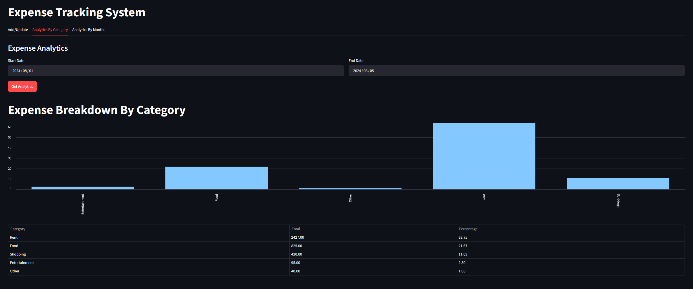
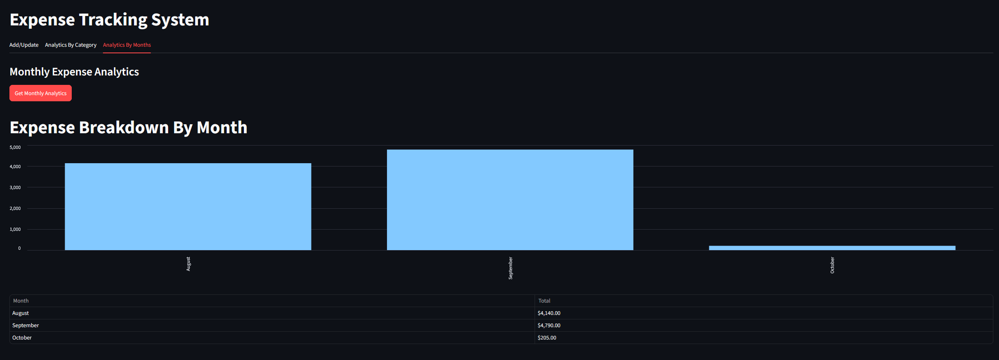

# 💰 Expense Tracking System

A full-stack **Expense Tracking System** built with a classic 3-Tier Architecture (Presentation, Logic, Data). 
It consists of a Streamlit frontend, a FastAPI backend, and a MySQL database.


## 📸 Screenshots

### Analytics By Category

### Analytics By Months

---

## 📁 Project Structure

```
Project_expense_tracking_system/
│
├── backend/                  # FastAPI backend
│   ├── __init__.py
│   ├── server.py             # API routes & endpoints
│   ├── db_helper.py          # All SQL logic (CRUD + Analytics)
│   ├── logging_setup.py      # Configures logging to server.log
│   └── server.log            # Backend log file
│
├── frontend/                 # Streamlit UI
│   ├── app.py                # Main entry point (creates tabs)
│   ├── add_update.py         # Add/Update tab
│   ├── analytics_by_category.py  # Analytics by Category tab
│   └── analytics_by_months.py    # Analytics by Months tab
│
├── tests/                    # Pytest test suite
│   ├── conftest.py
│   └── backend/
│       ├── test_db_helper.py
│       └── test_claude.py
│
├── requirements.txt          # Python dependencies
└── README.md
```

---

## 🛠️ Setup Instructions

### 1. Clone the repository
```bash
git clone https://github.com/username/expense-management-system.git
cd expense-management-system
```

### 2. Create and activate a virtual environment
```bash
python -m venv .venv

# Windows
.venv\Scripts\activate

# macOS/Linux
source .venv/bin/activate
```

### 3. Install dependencies
```bash
pip install -r requirements.txt
```

### 4. Set up the MySQL database
Create the database and table by running the following in your MySQL client:

```sql
CREATE DATABASE expense_manager_test;

USE expense_manager_test;

CREATE TABLE expenses (
    id INT AUTO_INCREMENT PRIMARY KEY,
    expense_date DATE NOT NULL,
    amount DECIMAL(10, 2) NOT NULL,
    category VARCHAR(50) NOT NULL,
    notes VARCHAR(255)
);

```

Then, update your database credentials inside `backend/db_helper.py` (the `config` dictionary).

**Note:** The application is currently configured to use the `expense_manager_test` database (see `config` in `backend/db_helper.py`). If you want to use a different database name, update the `config` dictionary accordingly.

### 5. Run the FastAPI server (from the project root)
```bash
uvicorn backend.server:app --reload
```
The API will be available at `http://127.0.0.1:8000`. 
Interactive docs: `http://127.0.0.1:8000/docs`

### 6. Run the Streamlit app (from the project root)
```bash
streamlit run frontend/app.py
```
The UI will open at `http://localhost:8501`.

### 7. (Optional) Run the tests
```bash
pytest -v -s tests/backend/test_db_helper.py
```

---

## 🔄 Data Flow (A Typical User Journey)

1. User opens browser → Streamlit serves `app.py` on `localhost:8501`.
2. User clicks the **"Analytics By Category"** tab → Streamlit calls `analytics_category_tab()`.
3. User picks dates & clicks "Get Analytics" → `requests.post("http://localhost:8000/analytics/", json=payload)` is sent.
4. FastAPI receives the request → `server.py` validates the JSON body against the `DateRange` Pydantic model.
5. FastAPI calls the helper → `db_helper.get_expense_summary(start, end)` executes a SQL query.
6. MySQL returns the aggregated rows → `db_helper.py` formats them into a list of dictionaries.
7. FastAPI returns the JSON → `server.py` sends it back to Streamlit with a `200 OK`.
8. Streamlit renders the chart → `analytics_by_category.py` converts the JSON into a Pandas DataFrame and draws the bar chart + table.

---

## 🏛️ Key Architectural Decisions

1. **Separation of Concerns**: The UI (`frontend`) never talks to the database directly—it only talks to the API (`backend`). This means you could swap out Streamlit for React later without changing the backend.
2. **Package Structure**: Using `backend/__init__.py` and running commands from the project root enables clean absolute imports (`from backend import db_helper`), which is more robust than relative imports.
3. **Stateless Backend**: The FastAPI backend holds no session state. Every request is self-contained. State lives in Streamlit's `st.session_state` on the frontend.
4. **Testable Data Layer**: By isolating all SQL in `db_helper.py`, the database logic can be tested independently from the API layer.
5. **Structured Logging**: `logging_setup.py` writes all backend events to `server.log` for easy debugging.

---

## 🏗️ Architectural Diagram

```
┌─────────────────────────────────────────────────────────────────────────────┐
│                                                                             │
│                        TIER 1: PRESENTATION LAYER                           │
│                         (User Interface - Streamlit)                        │
│                                                                             │
│   ┌─────────────────────────────────────────────────────────────────────┐   │
│   │                         frontend/app.py                             │   │
│   │         (Main entry point - sets title & creates tabs)              │   │
│   └───────────────────────────┬─────────────────────────────────────────┘   │
│                               │                                             │
│         ┌─────────────────────┼─────────────────────┐                       │
│         ▼                     ▼                     ▼                       │
│   ┌───────────────┐   ┌───────────────────┐   ┌───────────────────┐         │
│   │ add_update.py │   │ analytics_by_     │   │ analytics_by_     │         │
│   │               │   │ category.py       │   │ months.py         │         │
│   │ • Date picker │   │ • Date range      │   │ • Monthly totals  │         │
│   │ • 5 rows      │   │ • % Bar chart     │   │ • Bar chart       │         │
│   │ • Live Total  │   │ • Pandas table    │   │ • Pandas table    │         │
│   └───────┬───────┘   └─────────┬─────────┘   └─────────┬─────────┘         │
│           │                     │                       │                   │
│           │ requests.get/post   │ requests.post         │ requests.get      │
└───────────┼─────────────────────┼───────────────────────┼───────────────────┘
            │                     │                       │
            │      HTTP / REST (localhost:8000)           │
            ▼                     ▼                       ▼
┌─────────────────────────────────────────────────────────────────────────────┐
│                                                                             │
│                          TIER 2: APPLICATION LAYER                          │
│                           (Backend API - FastAPI)                           │
│                                                                             │
│   ┌─────────────────────────────────────────────────────────────────────┐   │
│   │                     backend/server.py                               │   │
│   │                                                                     │   │
│   │   GET  /expenses/{date}         →  List expenses for a date         │   │
│   │   POST /expenses/{date}         →  Replace expenses for a date      │   │
│   │   POST /analytics/              →  Summary by category (with %)     │   │
│   │   GET  /analytics_by_month/     →  Summary by month                 │   │
│   └───────────────────────────┬─────────────────────────────────────────┘   │
│                               │                                             │
│                               ▼                                             │
│   ┌─────────────────────────────────────────────────────────────────────┐   │
│   │                    backend/db_helper.py                             │   │
│   │                                                                     │   │
│   │   • get_expenses_by_date()                                          │   │
│   │   • insert_expense()                                                │   │
│   │   • delete_expense_by_date()                                        │   │
│   │   • get_expense_summary()                                           │   │
│   │   • get_expense_summary_by_month()                                  │   │
│   └───────────────────────────┬─────────────────────────────────────────┘   │
│                               │                                             │
│                               │  mysql.connector                            │
└───────────────────────────────┼─────────────────────────────────────────────┘
                                │
                                │   SQL Queries
                                ▼
┌─────────────────────────────────────────────────────────────────────────────┐
│                                                                             │
│                             TIER 3: DATA LAYER                              │
│                              (Database - MySQL)                             │
│                                                                             │
│   ┌─────────────────────────────────────────────────────────────────────┐   │
│   │                         MySQL Database                              │   │
│   │                     (expense_manager_test)                          │   │
│   │                                                                     │   │
│   │   Table: expenses                                                   │   │
│   │   ┌──────┬──────────────┬──────────┬────────────┬───────────────┐   │   │
│   │   │  id  │ expense_date │  amount  │  category  │     notes     │   │   │
│   │   ├──────┼──────────────┼──────────┼────────────┼───────────────┤   │   │
│   │   │   5  │  2024-08-03  │   100    │    Food    │ Dinner at...  │   │   │
│   │   │  15  │  2024-08-03  │    60    │    Food    │ Dinner at...  │   │   │
│   │   └──────┴──────────────┴──────────┴────────────┴───────────────┘   │   │
│   └─────────────────────────────────────────────────────────────────────┘   │
│                                                                             │
└─────────────────────────────────────────────────────────────────────────────┘
```

---

## 🚀 Features

- ✅ Add, update, and delete expenses by date
- ✅ Analytics by Category (with % breakdown)
- ✅ Analytics by Month (aggregated totals)
- ✅ Live total metric on the Add/Update tab
- ✅ Full test suite with Pytest
- ✅ Structured logging to `server.log`

---

## 🧰 Tech Stack

| Layer | Technology |
|-------|------------|
| Frontend | Streamlit, Pandas, Altair |
| Backend | FastAPI, Pydantic |
| Database | MySQL |
| Testing | Pytest |
| Language | Python 3.14 |